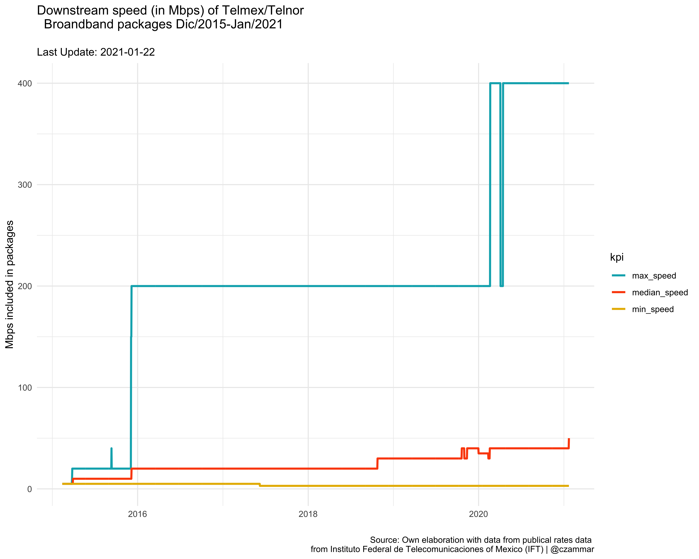

# Historical changes in broadband speed from incumbent operator from Mexico

## 1. Intro

In Mexican broadband market, Telmex and Telnor are the main industry actors, with a co-joint market share close to 57%. It is fair to say that telecommunucation operators in Mexico typically use their marketing campaigns to communicate the downstream speed of their services and usually describe it as "packages with some number of Megas included", but they just refere to a threshold of maximum speed to provide because Internet services in the country are (mostly) assymetric.

So, this repo explore how the offered downstream speed in broadband packages has changed for the main mexican operator. We present a visualization based in public data from Instituto Federal de Telecomunicaciones (IFT) from Mexico(https://bit.ift.org.mx/BitWebApp/) and the package Tydiverse from R.


# 2. Mbps in Telmex offer


## 2.1 How it was constructed?

* IFT has a repository for key indicators of telecommunications in Mexico ([Banco de Informaciòn de Telecomunicaciones](https://bit.ift.org.mx/BitWebApp/)). Here, IFT uploads periodically a register from public rates of commercial offer in mexican market (considering the mix of broadband, telephone, broadcasting services and more). 

* This data include mainly:

  * Information of the telecomunications operator that offers the service,
  * Package information, such as name, description, rate, servicies to include; in the case of broadband services the dowstream publicited speed is also reported (in Megabits per second, Mbps).

* To proceed with our exploration, we extracted the data for 12/2015 - 01/2021, cleaned up and extract the information for all services from:

  * Teléfonos del Noroeste, S.A. de C.V. (Telnor)
  * Teléfonos de México, S.A.B. de C.V.(Telmex)

  **Note:** sometimes speed was not present in the related column, but was identified in description columns, so text processing was necessary.

* We consider the whole information provided for IFT, including residential and small bussines packages (not entreprises-oriented/dedicated services are included in IFT data)
* We estimate the minimum, maximund and media of Mbps of the packages.




## 2.2 Key points

* Before 2016, Telmex/Telnor just offered 5 and 10 Mbps.

* In 2016 and until 2020, they followed these strategies:

  * Expand the offer to include packages with more Mbps (until 200 Mbps), 
  * They also increase the Mbps in their packages *without changing the price*.
  * Introduce a cheaper service, with 3 Mbpbs.

* Even with all this dynamics:

  * The median publicited speed of Telmex/Telnor packages is still under 50 Mbps;
  * This is reflected in the fact that, the most popular package [Paquete 389](https://telmex.com/web/hogar/paquetes-de-internet-con-disney?gclid=EAIaIQobChMIyujUsNvE7gIVxP_jBx3ypQbPEAAYASAAEgJDk_D_BwE&gclsrc=aw.ds) of Telmex and Telnor, offers just 30 Mbps ~ 19 USD/Month.

* Nowadays, Telmex offers a package with 400 Mbps, probably due competitive preasure and changes of habits on customers behaviour in broadband needs.  


# 3. How to run it

Run in your terminal:

```
git clone https://github.com/czammar/telmex_speed.git
cd telmex_speed
```

Open Rstudio and run the script *telmex_mbps.R*; you can also apply:

```
Rscript ~/telmex_speed/telmex_mbps.R
```

The plot will be generated in the folder **images**

# 4. Folder structure

```
├── README.md <- Our readme
├── data <- All relevant data is placed here
├── images <- Folder for images
└── src <- scripts folder (in R)
    ├── download_data.R <- extraction
    └── fixed_services.R <- data cleaning and plot
```
